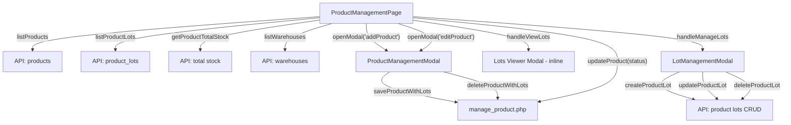

# หน้าจัดการสินค้า (Products Page)

**URL:** `/?page=Products`
**Routing:** `App.tsx` บรรทัด 6689–6697

---

## ไฟล์ที่เกี่ยวข้อง

| ประเภท | ไฟล์ | บรรทัด | บทบาท |
|--------|------|--------|-------|
| **หน้าหลัก** | [ProductManagementPage.tsx](file:///c:/AppServ/www/CRM_ERP_V4/pages/ProductManagementPage.tsx) | 546 | แสดงตารางสินค้า, ตัวกรอง, ปุ่ม CRUD |
| **Modal เพิ่ม/แก้ไข** | [ProductManagementModal.tsx](file:///c:/AppServ/www/CRM_ERP_V4/components/ProductManagementModal.tsx) | 619 | ฟอร์มเพิ่ม/แก้ไขสินค้า + จัดการ Lot |
| **Modal จัดการ Lot** | [LotManagementModal.tsx](file:///c:/AppServ/www/CRM_ERP_V4/components/LotManagementModal.tsx) | 471 | CRUD Lot แต่ละรายการ (เปิดจากปุ่ม ➕ ในตาราง) |
| **Backend API** | [manage_product.php](file:///c:/AppServ/www/CRM_ERP_V4/api/Product_DB/manage_product.php) | 153 | create / update / delete (soft delete) |
| **Backend Lot** | [get_product_lots.php](file:///c:/AppServ/www/CRM_ERP_V4/api/get_product_lots.php) | — | ดึงข้อมูล Lot ตาม productId |
| **Service Layer** | [api.ts](file:///c:/AppServ/www/CRM_ERP_V4/services/api.ts) | — | `listProducts`, `listProductLots`, `getProductTotalStock`, `listWarehouses`, `updateProduct`, `updateProductLot`, `createProductLot`, `deleteProductLot` |
| **Product Service** | [productApi.ts](file:///c:/AppServ/www/CRM_ERP_V4/services/productApi.ts) | — | `saveProductWithLots`, `deleteProductWithLots` |

---

## ฟีเจอร์ที่ทำได้

### 1. แสดงรายการสินค้า (Product Table)

ตารางแสดงคอลัมน์:

| คอลัมน์ | คำอธิบาย |
|---------|----------|
| ID | Primary key ของสินค้า |
| รหัสสินค้า (SKU) | รหัสอ้างอิงสินค้า เช่น `PRD-001` |
| ชื่อสินค้า | ชื่อเต็มของสินค้า |
| ร้านค้า | ชื่อร้านที่ขาย |
| กลุ่ม Ads | ใช้จัดกลุ่มสินค้าที่มีขนาดต่างกันแต่ลงโฆษณาร่วมกัน |
| ต้นทุน(เฉลี่ย) | คำนวณจาก Lot ทั้งหมด (weighted average) |
| ราคาขาย(เฉลี่ย) | ดึงจากราคาขายของสินค้า |
| สต็อกทั้งหมด | ดึงจาก API `getProductTotalStock` |
| Lot ล่าสุด | แสดง lot_number ที่มี purchase_date ล่าสุด |
| สถานะ | Toggle switch Active/Inactive |
| การดำเนินการ | ปุ่ม: จัดการ Lot, ดู Lot, แก้ไข, ลบ |

> สินค้าที่มี SKU เริ่มต้นด้วย `UNKNOWN-PRODUCT-COMPANY` จะถูกซ่อนจากตาราง (System Reserved)

---

### 2. ตัวกรอง (Filters)

| ตัวกรอง | เงื่อนไข | หมายเหตุ |
|---------|----------|----------|
| หมวดหมู่ | กรองตาม `product.category` | เฉพาะสินค้า Active (ไม่นับ Inactive/Unknown) |
| ร้านค้า | กรองตาม `product.shop` | เฉพาะสินค้า Active |
| บริษัท | กรองตาม `product.companyId` | **แสดงเฉพาะ SuperAdmin** |

---

### 3. เพิ่มสินค้าใหม่ (Add Product)

เปิด `ProductManagementModal` มี 2 แท็บ:

#### แท็บ "ข้อมูลสินค้า" (Basic Info)
- **ฟิลด์บังคับ (*):** SKU, ชื่อสินค้า, หน่วยนับ, ต้นทุน, ราคาขาย, จำนวนคงเหลือ
- **ฟิลด์เพิ่มเติม:** หมวดหมู่, ร้านค้า, กลุ่ม Ads, รายละเอียด
- **CreatableSelect:** dropdown ที่พิมพ์ค่าใหม่ได้ ใช้กับหมวดหมู่, หน่วยนับ, ร้านค้า, กลุ่ม Ads
- **คำนวณกำไรอัตโนมัติ:** แสดงกำไรต่อหน่วยและอัตรากำไร (margin %)

#### แท็บ "จัดการ Lot" (Lot Management)
- เพิ่ม Lot ได้หลายรายการพร้อมกัน
- ฟิลด์ต่อ Lot: Lot Number, คลังสินค้า, จำนวน, วันที่รับเข้า, วันหมดอายุ, ต้นทุนต่อหน่วย, หมายเหตุ

---

### 4. แก้ไขสินค้า (Edit Product)

- เปิด `ProductManagementModal` พร้อม pre-fill ข้อมูลเดิม
- โหลด Lot ที่มีอยู่จาก API `listProductLots`
- บันทึกผ่าน `saveProductWithLots` → เรียก `manage_product.php` action=update

---

### 5. ลบสินค้า (Delete Product)

- **Soft delete:** อัปเดต `status = 'Inactive'` + ตั้ง `deleted_at = NOW()`
- สินค้า System Reserved (`UNKNOWN-PRODUCT-COMPANY`) ไม่สามารถลบได้
- มี confirm dialog ก่อนลบ

---

### 6. Toggle สถานะ Active/Inactive

- คลิก Toggle switch ในตารางเพื่อเปลี่ยนสถานะ
- เรียก `updateProduct(id, { status: newStatus })`
- รองรับหลายรูปแบบค่า: `'Active'`, `'Inactive'`, `'1'`, `'0'`, `'true'`, `'false'`, `'enabled'`, `'disabled'`

---

### 7. ดูข้อมูล Lot (View Lots) — ปุ่ม 👁️

เปิด Modal ในหน้า (inline) แสดง:
- **สรุปสต็อกตามคลัง:** แสดง card ต่อคลัง (สต็อกทั้งหมด, จำนวน Lot, Lot ที่ใช้งาน)
- **รายละเอียด Lot จัดกลุ่มตามคลัง:** ตาราง Lot Number, จำนวนรับเข้า, จำนวนคงเหลือ, ต้นทุนต่อหน่วย, วันหมดอายุ, สถานะ
- **Dropdown เลือกคลัง:** กรอง Lot ตามคลังที่เลือก

---

### 8. จัดการ Lot (Manage Lots) — ปุ่ม ➕

เปิด `LotManagementModal` ที่มีฟีเจอร์:
- **ค้นหา Lot Number:** ค้นหาด้วยข้อความ
- **กรองตามคลัง:** Dropdown เลือกคลัง
- **กรองตามสถานะ:** Active / Depleted / Expired
- **เพิ่ม Lot ใหม่:** ฟอร์ม Lot Number, คลังสินค้า, จำนวนรับเข้า, วันที่รับเข้า, วันหมดอายุ, ต้นทุนต่อหน่วย, หมายเหตุ, สถานะ
- **แก้ไข Lot ที่มีอยู่:** แก้ไขได้เฉพาะ ต้นทุนต่อหน่วย, วันหมดอายุ, สถานะ, หมายเหตุ (ฟิลด์หลักจะ disabled หาก Lot มี id แล้ว)
- **ลบ Lot:** ลบถาวรผ่าน `deleteProductLot(lotId)` พร้อม confirm

---

## Data Flow



---

## Database Tables

| ตาราง | ใช้งาน |
|-------|--------|
| `products` | ข้อมูลสินค้าหลัก (sku, name, description, category, unit, cost, price, stock, company_id, shop, ads_group, status, deleted_at) |
| `product_lots` | ข้อมูล Lot (lot_number, product_id, warehouse_id, quantity_received, quantity_remaining, purchase_date, expiry_date, unit_cost, notes, status) |
| `warehouses` | ข้อมูลคลังสินค้า |

---

## Props ที่ได้รับจาก App.tsx

```tsx
<ProductManagementPage
  products={companyProducts}     // Product[] - สินค้าของบริษัท
  openModal={openModal}          // (type, data?) => void
  currentUser={currentUser}      // User - ผู้ใช้ปัจจุบัน
  allCompanies={companies}       // Company[] - ทุกบริษัท (สำหรับ SuperAdmin filter)
/>
```

---

## สิทธิ์การใช้งาน

- **SuperAdmin:** เห็นตัวกรองบริษัท + จัดการสินค้าทุกบริษัท
- **Admin / อื่นๆ:** จัดการสินค้าเฉพาะบริษัทของตัวเอง
