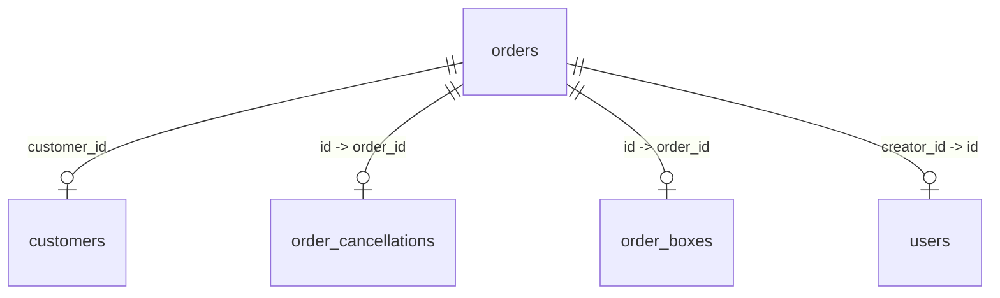

# คู่มือการสร้างรายงานออเดอร์เคสพิเศษ (Special Order Report Guide)

คู่มือนี้อธิบายขั้นตอน โครงสร้างข้อมูล และสคริปต์สำหรับการดึงข้อมูลรายงานคำสั่งซื้อเคสพิเศษ (ออเดอร์ที่มีสถานะถูกยกเลิกหรือตีกลับ - Returned/Cancelled) พร้อมทั้งจับคู่กับข้อมูลลูกค้า ข้อมูลสาเหตุการยกเลิก และเวลาที่สแตมป์สถานะจากระบบ CRM/ERP

---

## 🎯 วัตถุประสงค์
เพื่อออกรายงานสรุปออเดอร์ในกลุ่ม **ตีกลับ (Returned)** และ **ยกเลิก (Cancelled)** ในช่วงเวลาที่กำหนด โดยเจาะจงเฉพาะบริษัทและพนักงานที่มีบทบาทตามต้องการ พร้อมแสดงรายละเอียดการติดต่อลูกค้า เหตุผลการยกเลิก และ **วันเวลาที่สแตมป์สถานะยกเลิกหรือตีกลับ** เพื่อนำไปวิเคราะห์หาสาเหตุและปรับปรุงคุณภาพการขาย

---

## 🗄️ โครงสร้างข้อมูลและความสัมพันธ์ (Database Schema)

การดึงข้อมูลรายงานนี้จะอาศัยการเชื่อมโยง (Join) ของตารางหลัก ดังนี้:



1. **`orders` (ตารางเก็บข้อมูลคำสั่งซื้อหลัก)**
   * `id`: เลขที่ออเดอร์ (Primary Key)
   * `order_date`: วันที่สั่งซื้อ
   * `customer_id`: รหัสลูกค้า
   * `total_amount`: ยอดรวมคำสั่งซื้อ (หากสถานะเป็น Returned จะดึงจากยอด `cod_amount` ในตาราง `order_boxes` แทน)
   * `payment_method`: ช่องทางการชำระเงิน
   * `order_status`: สถานะคำสั่งซื้อ (เช่น 'Returned', 'Cancelled')
   * `company_id`: รหัสบริษัท (เช่น 1)
   * `creator_id`: รหัสพนักงานผู้สร้างออเดอร์

2. **`customers` (ตารางเก็บข้อมูลประวัติลูกค้า)**
   * `customer_id`: รหัสลูกค้า (Primary Key)
   * `first_name`: ชื่อลูกค้า
   * `last_name`: นามสกุลลูกค้า
   * `phone`: เบอร์โทรศัพท์ลูกค้า

3. **`order_cancellations` (ตารางเก็บข้อมูลการยกเลิกออเดอร์)**
   * `order_id`: รหัสคำสั่งซื้อ (Foreign Key -> orders.id)
   * `cancellation_type_id`: รหัสรูปแบบการยกเลิก (Foreign Key -> cancellation_types.id)
   * `notes`: หมายเหตุหรือเหตุผลการยกเลิกโดยละเอียด
   * `classified_at`: วันเวลาที่ระบบหรือผู้ใช้ทำการสแตมป์ประเภทการยกเลิก (Cancellation Stamp Time)

4. **`cancellation_types` (ตารางเก็บรหัสและชื่อประเภทการยกเลิก)**
   * `id`: รหัสประเภท (Primary Key)
   * `label`: ชื่อรูปแบบหรือประเภทการยกเลิก (เช่น ลูกค้าเปลี่ยนใจ, ติดต่อไม่ได้)

5. **`order_boxes` (ตารางเก็บข้อมูลกล่องสินค้าภายในออเดอร์)**
   * `order_id`: รหัสคำสั่งซื้อ (Foreign Key -> orders.id)
   * `return_created_at`: วันเวลาที่ระบบสแตมป์คืนสินค้าของกล่องนั้นๆ (Return Stamp Time)
   * *(หมายเหตุ: 1 ออเดอร์อาจประกอบด้วยหลายกล่อง ดังนั้นในการคำนวณวันเวลาที่ตีกลับของออเดอร์ จะใช้ค่าวันเวลาล่าสุดที่มีการสแตมป์คืนกล่องสินค้าผ่านฟังก์ชัน `MAX(return_created_at)`)*

6. **`users` (ตารางเก็บข้อมูลผู้ใช้งานระบบ / พนักงานขาย)**
   * `id`: รหัสพนักงาน (Primary Key)
   * `role`: บทบาทหรือสิทธิ์การเข้าใช้งานของพนักงาน (เช่น 6, 7 สำหรับ Telesale)
   * `role_id`: รหัสบทบาทของพนักงาน (เช่น 6 = Supervisor Telesale, 7 = Telesale)

---

## 📝 คำสั่ง SQL สำหรับดึงข้อมูล (Core Query)

คำสั่ง SQL หลักที่ใช้ดึงข้อมูลคำสั่งซื้อสถานะ Returned และ Cancelled ในช่วงเวลาที่ต้องการ ของบริษัท `company_id = 1` และสร้างโดยผู้มีสิทธิ์ `role_id IN (6,7)` พร้อมข้อมูลวันเวลาที่สแตมป์ยกเลิกหรือตีกลับ:

```sql
SELECT 
    o.id AS order_id,
    o.order_date,
    o.customer_id,
    c.first_name AS customer_first_name,
    c.last_name AS customer_last_name,
    c.phone AS customer_phone,
    IF(o.order_status = 'Returned', 
        COALESCE((SELECT SUM(ob.cod_amount) FROM order_boxes ob WHERE ob.order_id = o.id), 0), 
        o.total_amount
    ) AS total_amount,
    o.payment_method,
    o.order_status,
    ct.label AS cancel_type,
    oc.notes AS cancel_notes,
    oc.classified_at AS cancelled_at,
    (
        SELECT MAX(ob.return_created_at) 
        FROM order_boxes ob 
        WHERE ob.order_id = o.id
    ) AS returned_at
FROM orders o
LEFT JOIN customers c ON o.customer_id = c.customer_id
LEFT JOIN order_cancellations oc ON o.id = oc.order_id
LEFT JOIN cancellation_types ct ON oc.cancellation_type_id = ct.id
LEFT JOIN users u ON o.creator_id = u.id
WHERE o.order_date >= '2026-05-01 00:00:00'
  AND o.order_date <= '2026-05-31 23:59:59'
  AND o.company_id = 1
  AND u.role_id IN (6, 7)
  AND (
      o.order_status IN ('Returned', 'Cancelled')
      OR EXISTS (
          SELECT 1 FROM order_boxes ob2 
          WHERE ob2.order_id = o.id AND ob2.return_status IS NOT NULL
      )
  )
ORDER BY o.order_date DESC;
```

---

## 💻 สคริปต์ PHP สำหรับการส่งออกไฟล์ CSV (`export_csv.php`)

สคริปต์ต่อไปนี้ใช้สำหรับรันผ่าน localhost เพื่อดึงข้อมูลจากเซิร์ฟเวอร์หลักและสร้างไฟล์ CSV โดยมีระบบป้องกันปัญหาเปิดไฟล์ค้าง (File Lock) และรองรับภาษาไทยในโปรแกรม Excel (UTF-8 with BOM)

```php
<?php
error_reporting(E_ALL);
ini_set('display_errors', 1);

// กำหนดการเชื่อมต่อ Database บนเซิร์ฟเวอร์หลัก
$host = '202.183.192.218';
$user = 'primacom_agent';
$pass = 'k7VbQhjaLJdUcPbtBbEb';
$db   = 'primacom_mini_erp';

$conn = new mysqli($host, $user, $pass, $db);
$conn->set_charset("utf8mb4");

if ($conn->connect_error) {
    die("Connection failed: " . $conn->connect_error);
}

// กำหนดชื่อไฟล์ปลายทาง
$filename = __DIR__ . '/returned_cancelled_orders_may2026_comp1.csv';
$fp = fopen($filename, 'w');

if (!$fp) {
    die("ไม่สามารถสร้างไฟล์ CSV ได้ เนื่องจากไฟล์กำลังถูกเปิดใช้งานหรือติด Permission Lock");
}

// ใส่ BOM (Byte Order Mark) เพื่อให้ Excel เปิดอ่านภาษาไทยได้ถูกต้องโดยไม่เป็นภาษาต่างดาว
fwrite($fp, "\xEF\xBB\xBF");

// เขียน Header คอลัมน์ลงในไฟล์ CSV
$headers = [
    'Order ID',
    'Order Date',
    'Customer ID',
    'Customer Name',
    'Phone',
    'Total Amount',
    'Payment Method',
    'Order Status',
    'Cancel Type (รูปแบบยกเลิก)',
    'Cancel Reason (หมายเหตุยกเลิก)',
    'Cancel Date/Time (เวลายกเลิก)',
    'Return Date/Time (เวลาตีกลับ)'
];
fputcsv($fp, $headers);

// คำสั่ง SQL
$sql = "
    SELECT 
        o.id AS order_id,
        o.order_date,
        o.customer_id,
        CONCAT(c.first_name, ' ', c.last_name) AS customer_name,
        c.phone AS customer_phone,
        IF(o.order_status = 'Returned', 
            COALESCE((SELECT SUM(ob.cod_amount) FROM order_boxes ob WHERE ob.order_id = o.id), 0), 
            o.total_amount
        ) AS total_amount,
        o.payment_method,
        o.order_status,
        ct.label AS cancel_type,
        oc.notes AS cancel_notes,
        oc.classified_at AS cancelled_at,
        (
            SELECT MAX(ob.return_created_at) 
            FROM order_boxes ob 
            WHERE ob.order_id = o.id
        ) AS returned_at
    FROM orders o
    LEFT JOIN customers c ON o.customer_id = c.customer_id
    LEFT JOIN order_cancellations oc ON o.id = oc.order_id
    LEFT JOIN cancellation_types ct ON oc.cancellation_type_id = ct.id
    LEFT JOIN users u ON o.creator_id = u.id
    WHERE o.order_date >= '2026-05-01 00:00:00'
      AND o.order_date <= '2026-05-31 23:59:59'
      AND o.company_id = 1
      AND u.role_id IN (6, 7)
      AND (
          o.order_status IN ('Returned', 'Cancelled')
          OR EXISTS (
              SELECT 1 FROM order_boxes ob2 
              WHERE ob2.order_id = o.id AND ob2.return_status IS NOT NULL
          )
      )
    ORDER BY o.order_date DESC
";

$result = $conn->query($sql);
$count = 0;

if ($result && $result->num_rows > 0) {
    while ($row = $result->fetch_assoc()) {
        fputcsv($fp, [
            $row['order_id'],
            $row['order_date'],
            $row['customer_id'],
            $row['customer_name'],
            $row['customer_phone'],
            $row['total_amount'],
            $row['payment_method'],
            $row['order_status'],
            $row['cancel_type'] ?? '-',
            $row['cancel_notes'] ?? '-',
            $row['cancelled_at'] ?? '-',
            $row['returned_at'] ?? '-'
        ]);
        $count++;
    }
}

fclose($fp);
$conn->close();

echo "สร้างรายงานเรียบร้อยแล้ว! จำนวนทั้งหมด: " . $count . " รายการ\n";
echo "บันทึกไฟล์ที่: " . $filename . "\n";
?>
```

---

## ⚠️ ข้อควรระวังและแนวทางแก้ไขปัญหา (Troubleshooting)

1. **ปัญหา Database Access Denied / IP Block**
   * **อาการ:** เชื่อมต่อฐานข้อมูลไม่ได้ ติดบล็อกที่ระดับ Firewall ของเซิร์ฟเวอร์
   * **วิธีแก้ไข:** ตรวจสอบ IP ปัจจุบันของระบบและนำไปแจ้งแอดมินเซิร์ฟเวอร์เพื่อทำการ Allow IP ที่ Firewall หรือฐานข้อมูลหลัก

2. **ปัญหาภาษาไทยเป็นภาษาต่างดาวใน Excel**
   * **สาเหตุ:** Excel ไม่เข้าใจ encoding UTF-8 หากไม่มี BOM
   * **วิธีแก้ไข:** ใส่รหัส `fwrite($fp, "\xEF\xBB\xBF");` ก่อนทำการเขียนข้อมูลบรรทัดแรกในไฟล์ CSV ทุกครั้ง

3. **ปัญหา Permission Denied / Resource temporarily unavailable**
   * **สาเหตุ:** การเขียนไฟล์ทับชื่อเดิมในขณะที่ผู้ใช้งานเปิดไฟล์ CSV นั้นค้างไว้ในโปรแกรม Excel หรือ Text Editor อื่นๆ
   * **วิธีแก้ไข:** ปิดไฟล์ CSV ก่อนรันสคริปต์ใหม่ หรือตั้งชื่อไฟล์ใหม่แบบระบุเวอร์ชัน (เช่น เพิ่ม `_v2`, `_v3` หรือใช้ timestamp `time()`)
