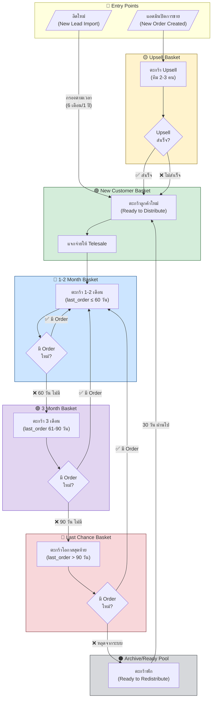
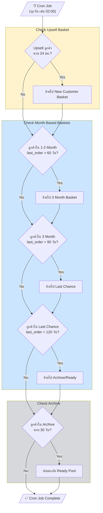
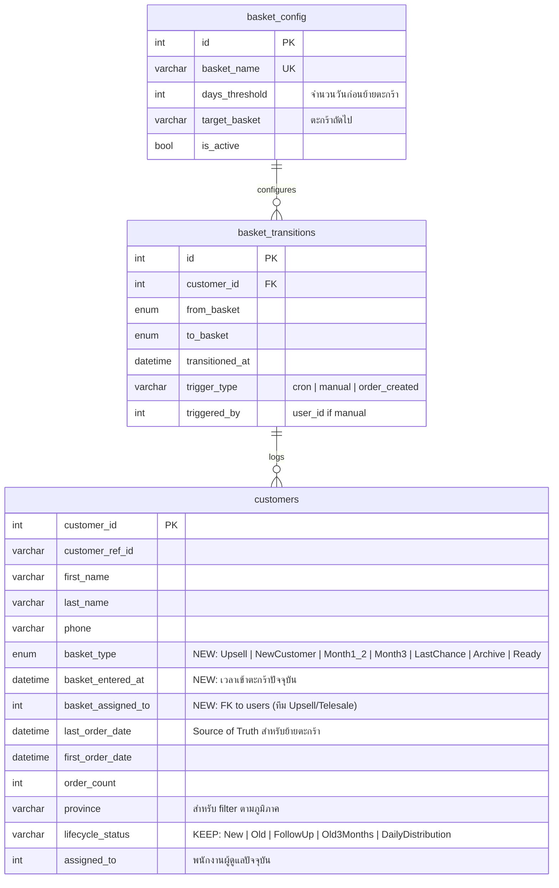

# 🧺 Basket Campaign System - Flowcharts

## Overview

ระบบใหม่จะเน้น **"ออเดอร์ล่าสุด" (`last_order_date`)** เป็นตัวกำหนดการเคลื่อนย้ายระหว่างตะกร้า แทนที่จะใช้ `ownership_expires` แบบเดิม

---

## 📦 Reusable Components Analysis

### ✅ Reuse 100% (ไม่ต้องเขียนใหม่)

| Component | Source | Purpose |
|-----------|--------|---------|
| `CustomerTable` | `components/CustomerTable.tsx` | แสดง table ลูกค้า |
| `Spinner` | `components/Spinner.tsx` | Loading indicator |
| `DateRangePicker` | `components/DateRangePicker.tsx` | เลือกช่วงเวลา |
| `StatCard` | `components/StatCard.tsx` | Card แสดงสถิติ |
| `mapCustomerFromApi` | `utils/customerMapper.ts` | แปลง API → Customer type |
| `usePersistentState` | `utils/usePersistentState.ts` | Save filter state |

### 🔄 Copy & Modify (~80% Reuse)

| Component | From | Action |
|-----------|------|--------|
| `DateFilterButton` | `TelesaleDashboard.tsx:44-52` | ย้ายเป็น shared component |
| `FilterDropdown` | `TelesaleDashboard.tsx:54-98` | ย้ายเป็น shared component |
| `formatThaiDateTime` | `TelesaleDashboard.tsx:100-123` | ย้ายไป `utils/dateUtils.ts` |
| `parseDateSafe` | `TelesaleDashboard.tsx:6-14` | ย้ายไป `utils/dateUtils.ts` |

### 🔌 API Functions (Reuse ทั้งหมด)

- `listCustomers`, `listCustomersBySource`, `getCustomerStats`, `getTelesaleUsers`, `bulkDistributeCustomers`

### 🆕 ต้องเขียนใหม่

| Component | Reason |
|-----------|--------|
| `BasketTabs` | Tab ใหม่สำหรับ 6 ตะกร้า |
| `RegionFilter` | Filter ตามภูมิภาค (เหนือ, อีสาน, กลาง, ใต้) |
| Cron Job Logic | `run_events.php` - logic ย้ายตะกร้าตาม `last_order_date` |
| New API Endpoints | `/basket/transition`, `/basket/stats` |
| Database Columns | `basket_type`, `basket_entered_at` |

### 📊 Summary: ~50-60% Code Reuse

| Category | Reuse % |
|----------|---------|
| UI Components | ~70% |
| Utility Functions | ~90% |
| API Functions | ~60% |
| Business Logic | ~30% |
| Backend/Cron | ~10% |

---




---

## Flowchart 2: Daily Cron Job Logic



---

## Flowchart 3: Database Design (New/Modified Columns)



---

## New Pages Structure

### Page 1: `TelesaleDashboardV2.tsx`

```
┌─────────────────────────────────────────────────────────────┐
│  Telesale Dashboard V2                      [Sync] [Filter] │
├─────────────────────────────────────────────────────────────┤
│  ┌─────────┐ ┌─────────┐ ┌─────────┐ ┌─────────┐ ┌────────┐ │
│  │ Upsell  │ │   New   │ │  1-2M   │ │   3M    │ │  Last  │ │
│  │   (5)   │ │  (12)   │ │  (45)   │ │  (20)   │ │  (8)   │ │
│  └─────────┘ └─────────┘ └─────────┘ └─────────┘ └────────┘ │
├─────────────────────────────────────────────────────────────┤
│  [Filter: ภูมิภาค ▼] [Sort: Last Order ▼] [Hide Called ☐]  │
├─────────────────────────────────────────────────────────────┤
│  ┌─────────────────────────────────────────────────────────┐│
│  │ Customer List (ตามแท็บที่เลือก)                         ││
│  │ • ชื่อลูกค้า | เบอร์โทร | Last Order | จังหวัด | Grade  ││
│  │ • ชื่อลูกค้า | เบอร์โทร | Last Order | จังหวัด | Grade  ││
│  │ • ...                                                   ││
│  └─────────────────────────────────────────────────────────┘│
└─────────────────────────────────────────────────────────────┘
```

### Page 2: `CustomerDistributionV2.tsx`

```
┌─────────────────────────────────────────────────────────────┐
│  Customer Distribution V2                    [Refresh Stats]│
├─────────────────────────────────────────────────────────────┤
│  Source Basket:  [Upsell ▼] [New Customer ▼] [Ready Pool ▼] │
│  Target Agents:  [☑ Agent 1] [☑ Agent 2] [☐ Agent 3] ...   │
│  Region Filter:  [☑ อีสาน] [☐ เหนือ] [☐ ใต้] [☐ กลาง]      │
├─────────────────────────────────────────────────────────────┤
│  Distribution Count: [___10___] per agent                   │
│  Preview Assignments:                                       │
│  ┌─────────────────────────────────────────────────────────┐│
│  │ Agent 1: 10 customers (อีสาน: 8, กลาง: 2)               ││
│  │ Agent 2: 10 customers (อีสาน: 10)                       ││
│  └─────────────────────────────────────────────────────────┘│
│                                        [Preview] [Execute]  │
└─────────────────────────────────────────────────────────────┘
```

---

## Key Logic Changes (Summary)

| เดิม | ใหม่ |
|------|------|
| `ownership_expires` เป็นตัวกำหนด | `last_order_date` เป็นตัวกำหนด |
| 2 bucket: waiting / ready | 6+ buckets: Upsell, NewCustomer, Month1_2, Month3, LastChance, Archive |
| ไม่มี Upsell workflow | มี Upsell basket (24 ชม.) |
| ไม่มี region filter | มี province/region filter |
| แก้หน้าเดิม | สร้างหน้า V2 ใหม่ |

---

## Verification Plan

### Manual Testing
1. **Upsell Flow**: สร้าง order ใหม่ → ลูกค้าต้องเข้า Upsell basket → 24 ชม. ผ่านไป → ย้ายไป New Customer
2. **Month Transition**: ลูกค้าใน 1-2 Month → ไม่มี order 60 วัน → ย้ายไป 3 Month
3. **Last Chance**: ลูกค้าใน 3 Month → ไม่มี order 90 วัน → ย้ายไป Last Chance
4. **Re-purchase**: ลูกค้าใน Last Chance → สร้าง order ใหม่ → กลับไป 1-2 Month

### Backend Testing
- Run `run_events.php` manually และตรวจสอบ output log
- Check `basket_transitions` table สำหรับ audit trail

---

## 🗑️ Deprecation / Cleanup (หลัง V2 สมบูรณ์)

> ⚠️ **ดำเนินการหลังจาก V2 ใช้งานได้ stable แล้วเท่านั้น**

### Database Columns (DEPRECATE)

| Column | Table | Reason | Action |
|--------|-------|--------|--------|
| `ownership_expires` | `customers` | ถูกแทนด้วย `last_order_date` + `basket_type` | Keep แต่ไม่ใช้ใน logic ใหม่ |
| `is_in_waiting_basket` | `customers` | ถูกแทนด้วย `basket_type = 'Archive'` | Migrate แล้ว DROP |
| `waiting_basket_start_date` | `customers` | ถูกแทนด้วย `basket_entered_at` | Migrate แล้ว DROP |

### Backend Files (DEPRECATE or MAJOR REWRITE)

| File | References | Action |
|------|------------|--------|
| `api/ownership_handler.php` | ถูกใช้ 10+ APIs | ⚠️ **REWRITE** - logic ใหม่ทั้งหมด |
| `api/ownership.php` | 50+ lines ownership logic | ⚠️ **REWRITE** หรือ DEPRECATE |
| `api/recreate_events.php` | Rebuild waiting basket | **DEPRECATE** → ใช้ new basket logic |
| `api/event/run_events.php` | Cron job เดิม | ⚠️ **MAJOR REWRITE** → `run_basket_events.php` |

### Frontend Logic (CLEANUP)

| File | Lines | What to Clean |
|------|-------|---------------|
| `App.tsx` | 20+ refs | Remove `ownershipExpires`, `isInWaitingBasket` handling |
| `TelesaleDashboard.tsx` | 1823 lines | **HIDE** เมนู → ใช้ V2 แทน |
| `CustomerDistributionPage.tsx` | 1888 lines | **HIDE** เมนู → ใช้ V2 แทน |
| `customerMapper.ts` | 5 refs | Keep backward compat, add new fields |
| `types.ts` | Type defs | Add new `BasketType` enum |

### Migration Script (ตัวอย่าง)

```sql
-- Step 1: Add new columns
ALTER TABLE customers 
  ADD COLUMN basket_type ENUM('Upsell','NewCustomer','Month1_2','Month3','LastChance','Archive','Ready') DEFAULT 'Ready',
  ADD COLUMN basket_entered_at DATETIME NULL DEFAULT NULL;

-- Step 2: Migrate existing data
UPDATE customers 
SET basket_type = CASE
    WHEN is_in_waiting_basket = 1 THEN 'Archive'
    WHEN assigned_to IS NULL THEN 'Ready'
    WHEN DATEDIFF(NOW(), last_order_date) <= 60 THEN 'Month1_2'
    WHEN DATEDIFF(NOW(), last_order_date) <= 90 THEN 'Month3'
    WHEN DATEDIFF(NOW(), last_order_date) <= 120 THEN 'LastChance'
    ELSE 'Archive'
END,
basket_entered_at = COALESCE(waiting_basket_start_date, date_assigned, NOW());

-- Step 3: (After stable) Drop old columns
-- ALTER TABLE customers DROP COLUMN is_in_waiting_basket;
-- ALTER TABLE customers DROP COLUMN waiting_basket_start_date;
-- KEEP ownership_expires for reporting history
```

### Cleanup Checklist

- [ ] V2 pages deployed and stable (2+ weeks)
- [ ] Menu swap completed (hide old pages)
- [ ] Run migration script for `basket_type`
- [ ] Update all APIs to use `basket_type` instead of `is_in_waiting_basket`
- [ ] Update cron job to `run_basket_events.php`
- [ ] Remove old event handlers (ownership.php logic)
- [ ] Optional: DROP deprecated columns after backup

