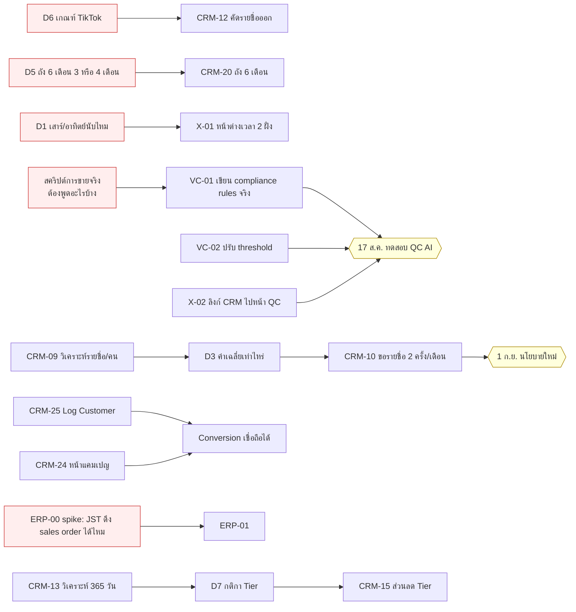

# 🗺 Roadmap — สิงหาคม 2026

> **กำลังคน**: คุณ + dev 1–2 คน (AI ช่วยเขียนโค้ด)
> **ขอบเขต**: 3–29 ส.ค. 2026 · 4 sprint
> **เดดไลน์ผูกมัด**: QC AI ทดสอบจริง **จันทร์ 17 ส.ค.**
> **อ้างอิง**: [MASTER_BACKLOG.md](MASTER_BACKLOG.md) · [2026-07-31.md](2026-07-31.md)

---

## 🔁 แก้จากฉบับแรก — QC AI ไม่ใช่งานของ repo นี้ และเกือบเสร็จแล้ว

ฉบับแรกผมตีว่า QC AI เป็นงานสร้างใหม่ขนาด `L` แล้วเอามาแขวนไว้กลาง roadmap ของ CRM_ERP_V4 — **ผิดทั้งสองอย่าง**

QC AI อยู่ที่ **`C:\AppServ\www\voicecall`** (deploy ที่ `voicecall.prima49.com`) ซึ่งสร้างไปแล้วเกือบครบ:

| ที่ประชุมขอ | ในโค้ดมีอะไรอยู่แล้ว | เหลืออะไร |
|---|---|---|
| จับ Keyword แนะนำตัว / แจ้งชื่อบริษัท | `ComplianceAgent.php` + ตาราง `compliance_rules` (`prohibited_words` / `required_phrases`) | ⚠️ **rule ยังเป็น placeholder** — migration 002 เขียนกำกับเองว่า *"not yet reviewed against this company's real policy"* · rule "แนะนำตัวเอง" **ยังไม่มี** · rule ชื่อบริษัท hardcode `'เทพมงคล'` บริษัทเดียว |
| Talk time นานผิดปกติ (>1–2 ชม.) | `LongCallController` + `ui/long_calls.html` — bucket 10/20/30/45/60 นาที | ⚠️ bucket สูงสุดแค่ **60 นาที** ที่ประชุมพูดถึง 1–2 ชม. → ต้องเพิ่ม 90/120 |
| สแปมเบอร์เดิมซ้ำ ๆ นอก CRM | `GhostNumberService` + `ui/ghost_numbers.html` — `MIN_CALLS=2`, `MIN_DURATION=30s`, risk level ตามจำนวนวัน/ชั่วโมง | ⚠️ ที่ประชุมพูด "วันละ 10 นาทีทุกวัน" → ต้องเทียบ threshold ปัจจุบันว่าจับได้จริงไหม |
| — *(ประชุมไม่ได้ขอ แต่มีแล้ว)* | `FraudCheckService` — จับพนักงานแจ้ง**บัญชีรับเงินส่วนตัว** cross-check กับ `bank_account` จริง | ✅ ของแถมที่ควรเอาไปโชว์วันที่ 17 |
| Pipeline ไฟล์เสียง → AI | `SttAgent`, `AudioFetcher`, `OneCallClient`, `SmartSamplingService`, cron `process_pending.php` | ✅ ทำงานอยู่ |
| หน้าจอให้ Sup รีวิว | UI 8 หน้า (`fraud_dashboard`, `ghost_numbers`, `long_calls`, `cost_dashboard`, …) | ⚠️ **CRM ยังไม่มีลิงก์ไปหน้าพวกนี้เลย** — Sup ต้องจำ URL เอง |

> ### ผลต่อแผน
> **QC AI: จาก `L` (1–2 สัปดาห์ สร้างใหม่) → `S–M` (3–4 วัน จูน + deploy)**
> **CRM_ERP_V4 ได้เลนคืนเกือบทั้งเลน** → ดึง Tier เฟส 1 และ ERP-01 เข้ามาในเดือน ส.ค. ได้

**2 เรื่องที่ต้องทำ 2 ฝั่งพร้อมกัน** (ฉบับแรกตกไป — เพิ่มเข้ามาแล้ว):

| ID | งาน | ทำไมต้อง 2 ฝั่ง |
|---|---|---|
| **X-01** | หน้าต่างนับเวลา 07:00–18:30 | `GhostNumberService` query แค่ `call_date BETWEEN ?` **ไม่มี TIME filter** — ถ้าแก้แต่ฝั่ง CRM ตัวเลข 2 ระบบจะขัดกัน แล้วเถียงกันไม่จบว่าใครถูก |
| **X-02** | ลิงก์จาก CRM → หน้า QC | ตอนนี้ CRM ต่อ voicecall แค่จุดเดียว (`api_search_audio.php` ใน `ReturnedOrdersReportService`) — Sup เข้าหน้า QC ไม่ได้จากในระบบ |

> ✅ **จุดที่ 2 ระบบตรงกันอยู่แล้ว**: voicecall ใช้ `duration_seconds >= 30` เป็นเกณฑ์ "ได้คุย" ตรงกับมาตรฐาน CRM แล้ว ไม่ต้องแก้

---

## 🧠 หลักคิด — คอขวดไม่ได้อยู่ที่การเขียนโค้ด

เมื่อ AI ช่วยเขียนโค้ด **เวลาเขียนหดลง 3–5 เท่า แต่มี 4 อย่างที่ไม่หดเลย**:

| ไม่หด | ผลต่อแผน |
|---|---|
| **การตัดสินใจ (D1–D12)** | **critical path ตัวจริง** |
| **การเข้าถึงข้อมูลภายนอก** (JST sales API, ไฟล์ค่าส่ง) | บล็อก ERP ทั้งเส้น |
| **การ validate ตัวเลขบน prod** | งาน "แก้ตัวเลข" ช้ากว่าที่คิดเสมอ |
| **การประกาศ/เทรนทีม** | นโยบายใหม่ต้องเผื่อเวลา rollout |

> 🔑 **แรงของคุณควรไปที่ไล่คำตอบ D1–D12 และการขอข้อมูล ไม่ใช่การคิวงาน dev เพิ่ม**

**สเกล**: `โค้ด` = เวลาเขียนจริงเมื่อมี AI ช่วย · `Lead` = จนขึ้น prod ใช้ได้จริง

---

## 📦 แยกโปรเจกต์ก่อน — งานอยู่คนละที่

| Track | Repo | จำนวนงาน | สถานะ |
|---|---|---|---|
| **VC** — QC AI / ตรวจสายโทร | `C:\AppServ\www\voicecall` | 6 | 🟢 ~85% เสร็จ เหลือจูน |
| **CRM** — Telesale / Dashboard / นโยบาย | `C:\AppServ\www\CRM_ERP_V4` | **20** | 🔴 ยังไม่เริ่ม |
| **ERP** — B2B / ตัวแทน / ต้นทุน | `C:\AppServ\www\CRM_ERP_V4` | 9 | 🔴 เกือบทั้งเส้นติด G4 |

---

## 🛤 Critical Path

**กล่องแดง = ไม่ใช่โค้ด แต่บล็อกโค้ดอยู่** — ต้องปลดทั้งหมดภายในสัปดาห์นี้

> 💡 สังเกตว่า **สคริปต์การขายจริง** กลายเป็นตัวบล็อกใหม่ของ 17 ส.ค. แทน "ไฟล์เสียง"
> เพราะ pipeline เสียงทำงานอยู่แล้ว สิ่งที่ขาดคือ *"เซลล์ต้องพูดอะไรบ้างถึงจะผ่าน"*

---

## 👥 แบ่งเลนตามไฟล์ที่แตะ

| Lane | คน | ถือไฟล์ | งานเดือนนี้ |
|---|---|---|---|
| **A** | **คุณ** | `voicecall/*` · `api/Onecall_DB/*` · `api/Monitor/*` · `api/Reports/*` · `api/Services/*` | จูน QC AI, X-01, Log Customer, ERP-01 |
| **B** | **Dev 1** (frontend) | `pages/*.tsx` · `components/*.tsx` | ส่วนลด Upsell, รวมหน้าประวัติ, verify แคมเปญ, X-02, Tier UI |
| **C** | **Dev 2** (data/config) | `api/basket_config.php` · `api/Controllers/Distribution*` · query/report | คัด TikTok, ถัง 6 เดือน, เคลียร์ tag, วิเคราะห์, นโยบายแจกรายชื่อ |

> ⚠️ **จุดชน 2 จุด**
> 1. `api/Reports/telesale_campaign_compare.php` — B verify (CRM-24) / A แก้ (X-01) → **B ต้องเสร็จก่อน**
> 2. `pages/CreateOrderPage.tsx` (>10,000 บรรทัด) — **B ถือคนเดียวทั้งเดือน** ห้ามคนอื่นแตะ

---

## 📅 Sprint Plan

### 🔴 Sprint 1 · จ.3 – ศ.7 ส.ค. — เก็บของถูกให้หมด + ยิง spike ตัวเสี่ยง

| Lane | ID | งาน | โค้ด | Lead | บล็อก |
|---|---|---|---|---|---|
| A | **VC-01** | เขียน compliance rules จริง แทน placeholder (+ rule "แนะนำตัวเอง" ที่ยังไม่มี + รองรับหลายบริษัท ไม่ใช่ hardcode) | 0.5 ว. | 2 ว. | 🔴 สคริปต์การขายจริง |
| A | **VC-02** | ปรับ threshold: long call เพิ่ม bucket 90/120 นาที · ทวน ghost number ว่าจับ "วันละ 10 นาทีทุกวัน" ได้จริง | 0.5 ว. | 1 ว. | — |
| A | **ERP-00** | 🎯 **Spike: JST ดึง sales order ได้ไหม** (ไม่ใช่แค่ inventory) | 0.5 ว. | 1 ว. | 🔴 JST scope |
| B | **CRM-24** | Verify หน้าแคมเปญ + อุดช่องที่ขาด | 0.3 ว. | 1 ว. | — |
| B | **CRM-21** | ส่วนลด/รหัสส่วนลดในหน้า Upsell | 1 ว. | 2 ว. | — |
| B | **X-02** | ลิงก์จาก CRM → หน้า QC (fraud / ghost / long calls) + จัดสิทธิ์ Sup | 0.5 ว. | 1 ว. | — |
| C | **CRM-12** | คัดรายชื่อ TikTok เก่าออกจากการแจก | 0.3 ว. | 1 ว. | 🔴 D6 |
| C | **CRM-09** | วิเคราะห์รายชื่อถือครองต่อคน | 0.5 ว. | 1 ว. | — |
| C | **CRM-20** | ถัง 6 เดือน (config + logic) | 0.5 ว. | 2 ว. | 🔴 D5 |
| C | **CRM-22** | เคลียร์ tag สถานะโทรตอนโอนย้าย | 0.5 ว. | 1.5 ว. | — |

**🚩 M1 (ศ. 7 ส.ค.)**
- ☐ Quick win ปิดครบ 7 งาน
- ☐ QC AI **dry-run ได้แล้ว** — เหลือแค่รอ policy จริงมาใส่
- ☐ **รู้คำตอบแล้วว่า JST ดึง sales order ได้หรือไม่** ← unknown ที่ใหญ่ที่สุดในแผน ตัดจบตั้งแต่สัปดาห์แรก
- ☐ ส่งตัวเลขรายชื่อถือครองให้ผู้บริหาร → ปลดล็อก D3

> **ทำไม ERP-00 ต้องอยู่ Sprint 1** — ถ้า JST ไม่มีทางดึง sales order ออกมา สาย ERP ทั้ง 9 งานต้องคิดใหม่หมด
> รู้ตอนสัปดาห์ที่ 1 เสียเวลาครึ่งวัน · รู้ตอนสัปดาห์ที่ 4 เสียแผนทั้งไตรมาส

---

### 🟠 Sprint 2 · จ.10 – ศ.14 ส.ค. — ปิด QC AI + ทำตัวเลขให้ตรงกันทั้ง 2 ระบบ

| Lane | ID | งาน | โค้ด | Lead | หมายเหตุ |
|---|---|---|---|---|---|
| A | **VC-03** | ComplianceController CRUD — แก้ rule จาก UI ไม่ต้องแก้ SQL | 1 ว. | 2 ว. | code comment เขียนไว้เองว่า *"once built"* |
| A | **X-01** | หน้าต่าง 07:00–18:30 — **ทั้ง CRM (~9 endpoint) และ voicecall** | 1 ว. | **3 ว.** | 🔴 D1 · เวลาหมดไปกับ validate เทียบของเก่า |
| A | **CRM-25** | Log Customer เฟส 1 — แยก inbound/outbound ผ่าน `order_tags` | 1 ว. | 2 ว. | ใช้ migration 070 ที่มีแล้ว |
| B | **CRM-23** | รวมประวัติโทร+นัดหมาย+ออเดอร์ เป็น timeline เดียว | 1 ว. | 2 ว. | ยุบ 3 แท็บใน `CustomerDetailPage.tsx` |
| B | **VC-04** | ขัดหน้า QC ให้ Sup ใช้จริงได้ (mark ผล / filter รายคน) | 1 ว. | 2 ว. | ต่อยอด UI ที่มีอยู่ |
| C | **CRM-13** | วิเคราะห์ 365 วัน — ยอด + basket size แยกปุ๋ย/ชีวภัณฑ์ | 1 ว. | 3 ว. | ⚠️ ใช้ `orders.total_amount` เท่านั้น |
| C | **CRM-10** | สิทธิ์ขอรายชื่อ 2 ครั้ง/เดือน + เงื่อนไขเคลียร์ชุดแรก | 1.5 ว. | 3 ว. | 🔴 D3 |

**🚩 M2 (พฤ. 14 ส.ค.) — FREEZE ฝั่ง voicecall**
- ☐ QC AI หยุดแก้ เหลือแต่ทดสอบ (buffer 3 วันก่อน 17 ส.ค.)
- ☐ **เปิดหน้าที่มีตัวเลขเวลาโทรทั้ง CRM และ voicecall แล้วได้เลขเดียวกัน**
- ☐ ส่งผลวิเคราะห์ 365 วัน → ปลดล็อก D7

---

### 🟡 Sprint 3 · จ.17 – ศ.21 ส.ค. — ทดสอบจริง + Conversion เชื่อถือได้

**🎯 จันทร์ 17 ส.ค. = วันที่รับปากไว้**

| Lane | ID | งาน | โค้ด | Lead |
|---|---|---|---|---|
| A | — | **คุมทดสอบ QC AI + เก็บ false positive/negative** | — | ครึ่งสัปดาห์ |
| A | **CRM-25** ph.2 | Auto-detect inbound/outbound (ไม่ต้องติด tag มือ) | 1.5 ว. | 3 ว. |
| A | **ERP-01** | ดึง sales order ตัวแทนจาก JST *(ถ้า ERP-00 เขียว)* | 2 ว. | 4 ว. |
| B | **CRM-04** | นิยามเวลาทำงาน จ–ศ 09–18 / ส 09–16 | 0.5 ว. | 1.5 ว. |
| B | — | แก้ตาม feedback QC AI | — | ตามจริง |
| C | **CRM-11** | แจกไม่เท่ากันตามเกรด × performance | 2 ว. | 4 ว. |
| C | **CRM-10** | UAT นโยบายแจกรายชื่อ | — | 2 ว. |

**🚩 M4 (ศ. 21 ส.ค.)**
- ☐ QC AI ผ่านทดสอบ 1 สัปดาห์ มีสถิติ accuracy จริง
- ☐ **Conversion Rate เชื่อถือได้** (Log Customer + หน้าแคมเปญ ทำงานคู่กัน)
- ☐ ERP-01 ดึงข้อมูลออกมาได้

---

### 🟢 Sprint 4 · จ.24 – ส.29 ส.ค. — ส่งมอบนโยบาย + เปิด Tier เฟส 1

| Lane | ID | งาน | โค้ด | Lead | บล็อก |
|---|---|---|---|---|---|
| A | **ERP-01/02** | ปิด ERP-01 + ส่งข้อมูลให้บัญชีออกบิลตัวแทน | 2 ว. | 4 ว. | — |
| B | **CRM-15** | ส่วนลดท้ายบิลตาม Tier ในหน้าเปิดบิล | 2 ว. | 4 ว. | 🔴 D7 |
| C | **CRM-16** | บัตรสมาชิกอายุ 1 ปี + logic เลื่อน Tier | 1 ว. | 2 ว. | 🔴 D7 |
| C | **CRM-18** | Verify ส่วนลดโอน 1% ไม่พังตอนใส่ Tier | 0.3 ว. | 1 ว. | — |
| C | — | Rollout นโยบายแจกรายชื่อ + ประกาศทีม | — | 2 ว. | — |
| B | **CRM-26** | หน้ารวมราคา/โปรฯ ในระบบ (แทน Google Sheet) | 1 ว. | 2 ว. | 🔴 D9 |

**🚩 M5 (ศ. 28 ส.ค.)**
- ☐ **นโยบายแจกรายชื่อใหม่พร้อมใช้ 1 ก.ย.**
- ☐ **Tier เฟส 1 ใช้ได้** — คิดส่วนลดท้ายบิลตาม Tier ได้จริง
- ☐ CRM backlog จากประชุม 31 ก.ค. ปิด **~26/29**

---

### 🔵 กันยายนเป็นต้นไป

| โครงการ | งาน | เริ่มได้เมื่อ | ประมาณ |
|---|---|---|---|
| **Tier เฟส 2** | CRM-17 (cutover จากโปร 20K/2.5%), CRM-19 (หมวก) | D8 ตอบ | ~2 สัปดาห์ |
| **บิล/ตีกลับตัวแทน** | ERP-02, 05, 06, 07 | ERP-01 เสร็จ + D10 | ~3 สัปดาห์ |
| **ต้นทุนแฝงเข้า ERP** | ERP-08 (โบรชัวร์), ERP-09 (ค่าแพ็ค/ค่าส่ง) | D12 + ได้ไฟล์จากขนส่ง | ~1 เดือน |
| **B2B Portal** | ERP-04 | D11 | **XL — โครงการเดี่ยว ไม่ควรทำคู่กับอย่างอื่น** |
| **ต้นทุน/กำไรขาดทุน** | ERP-03 | ⛔ รอ ERP-08/09 | L |

---

## 📢 คำสั่งที่ต้องออกวันนี้ — ไม่ใช่งานโค้ด แต่บล็อกโค้ดอยู่

| # | สั่งใคร | สั่งว่าอะไร | ต้องได้ภายใน |
|---|---|---|---|
| 1 | **ผู้บริหาร + Sup** | 🔴 **สคริปต์การขายจริง** — เซลล์ต้องพูดอะไรบ้างถึงจะผ่าน QC (แนะนำตัวยังไง / แจ้งชื่อบริษัทว่าอะไรบ้าง — ตอนนี้ระบบรู้จักแค่ `'เทพมงคล'`) + ห้ามพูดอะไร | **อังคาร 4 ส.ค.** |
| 2 | **ผู้บริหาร (พี่ติ๊ก)** | ตอบ **D1** (เสาร์/อาทิตย์นับไหม), **D2** (บทลงโทษทุจริต), **D5** (50K ภายใน 3 หรือ 4 เดือน + "เซ็ตใหญ่" คือ SKU ไหน) | **พุธ 5 ส.ค.** |
| 3 | **ทีมแจกงาน (หนู/นุก)** | ตอบ **D6** — รายชื่อ TikTok ยุคแรกระบุยังไง | **อังคาร 4 ส.ค.** |
| 4 | **ฝ่ายที่ดูแล JST** | ขอ scope/สิทธิ์ที่ **ดึง sales order ได้** + ตอบ **D10** ("เซ็นรับของเข้าคลังสำเร็จ" = สถานะไหน) | **พุธ 5 ส.ค.** (ERP-00 รอใช้) |
| 5 | **ทีมการตลาด/แอดมิน** | ตั้งเจ้าภาพ **Promotion Sheet** (D9) | **พุธ 5 ส.ค.** |
| 6 | **ฝ่ายบัญชี** | ตอบ **D12** — ค่าแพ็ค/ค่าส่ง Flash + Airport/iPod ได้เป็นไฟล์อะไร ความถี่ ใครส่ง | ก่อนสิ้นเดือน |

> ### ⏱ ถ้าไม่ได้ตามนี้
> - **ไม่ได้สคริปต์การขายภายในอังคาร** → QC AI จับได้แต่ rule placeholder ที่ไม่ใช่ policy จริง → **17 ส.ค. โชว์ได้แต่ไม่มีความหมาย**
> - **ไม่ได้ D6 ภายในอังคาร** → Lane C ว่างงานวันพุธ (งานเขียนเสร็จใน 2 ชม.)
> - **ไม่ได้ JST scope ภายในพุธ** → ERP-00 spike ไม่จบใน Sprint 1 → ความเสี่ยงลอยไปถึงเดือนหน้า

---

## ✅ Definition of Done

ห้ามติ๊กเสร็จถ้าไม่ครบ 5 ข้อ:

1. ☐ ขึ้น prod แล้ว และ **hard-refresh แล้วเห็นของใหม่จริง**
2. ☐ ถ้าเป็นงานตัวเลข → **เทียบกับตัวเลขเดิมแล้ว อธิบายได้ว่าทำไมต่าง**
3. ☐ ถ้าแตะ backend CRM → แก้ทั้ง `config.php` ที่ root **และ** `api/config.php` (prod ใช้ตัว root)
4. ☐ ถ้าแตะ `basket_config` → รู้ตัวว่ากระทบ **ทุกบริษัท** (config เป็น global `company_id = 1`)
5. ☐ ติ๊ก ☑ ใน [MASTER_BACKLOG.md](MASTER_BACKLOG.md) — อย่าลบแถวทิ้ง

> **voicecall deploy ต่างจาก CRM**: ไม่มี build step — อัปโหลด PHP/HTML ตรงผ่าน FTP (ดู `voicecall/DEPLOY.md`)

---

## ⚠️ อะไรจะทำให้แผนนี้พัง

| ความเสี่ยง | โอกาส | ผล | กันยังไง |
|---|---|---|---|
| **คำตอบ D1–D12 + สคริปต์การขาย ไม่มา** | 🔴 สูง | dev ว่างงานทั้งที่มีงานคิว | ไล่ตามทุกเช้า ไม่ใช่รอ |
| **QC AI ทดสอบแล้ว false positive เยอะ** | 🟠 กลาง | ทีมไม่เชื่อถือ เลิกใช้ | ปล่อยเป็น "ของช่วย Sup ดู" ก่อน **ห้ามผูกกับการลงโทษในเดือนแรก** |
| **X-01 validate แล้วเจอตัวเลขเก่าผิดเยอะ** | 🟠 กลาง | บานปลายเป็น data cleanup | จำกัดขอบเขต: sprint นี้แค่ "ตรงกันทุกหน้า" ยังไม่แก้ข้อมูลย้อนหลัง |
| **ERP-00 ออกมาว่า JST ไม่มี API** | 🟠 กลาง | ERP ทั้งเส้นคิดใหม่ | **spike อยู่ Sprint 1 แล้ว — รู้เร็วที่สุดเท่าที่ทำได้** |
| **Lane B/C ชนไฟล์** | 🟢 ต่ำ | merge conflict | แบ่งไฟล์ไว้แล้ว ห้ามข้ามเลน |
| **งานแทรกจากประชุมวันอื่น** | 🔴 สูง | Sprint บวม | งานใหม่เข้า **Sprint ถัดไปเสมอ** ไม่แทรกกลาง sprint เว้นแต่ติด G1/G2 |

---

## 📊 น้ำหนักงานรวม

| Sprint | งาน | โค้ดรวม (คน-วัน) | เทียบกำลัง 3 คน × 5 วัน = 15 |
|---|---|---|---|
| Sprint 1 (3–7 ส.ค.) | 10 | ~5.1 | 34% ✅ |
| Sprint 2 (10–14 ส.ค.) | 7 | ~7.5 | 50% ⚠️ ตึงเพราะ X-01 ต้อง validate 2 ระบบ |
| Sprint 3 (17–21 ส.ค.) | 6 | ~6.0 | 40% ✅ เผื่อแก้ตาม feedback |
| Sprint 4 (24–29 ส.ค.) | 6 | ~6.3 | 42% ✅ |

> ตัวเลข "โค้ด" ต่ำเพราะ AI ช่วยเขียน — **เวลาที่เหลือคือ validate, ทดสอบ, และรอคำตอบ**
> sprint ไหนดูว่าง อย่าเพิ่งยัดงานเพิ่ม นั่นคือ buffer ที่ตั้งใจเผื่อ

---

*สร้าง 3 ส.ค. 2026 · แก้ครั้งที่ 1: แยก QC AI ออกไป track voicecall + เพิ่ม X-01/X-02/ERP-00*
*ทบทวนทุกวันศุกร์ตอนปิด sprint · ประชุมใหม่เข้าเป็น Sprint ถัดไป ไม่แทรกกลาง sprint*
